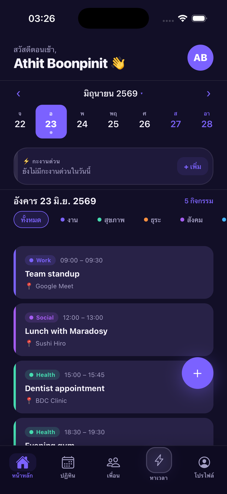
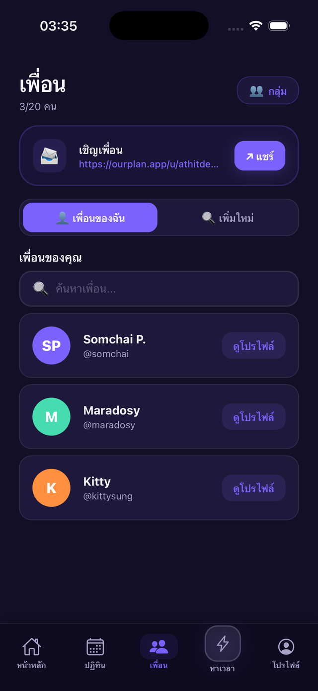
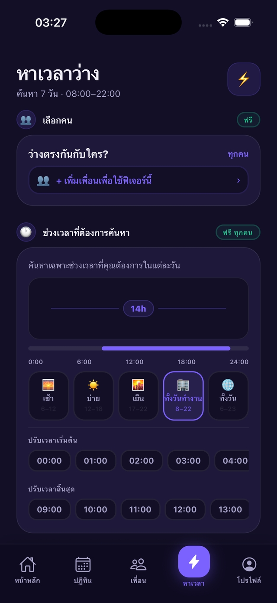
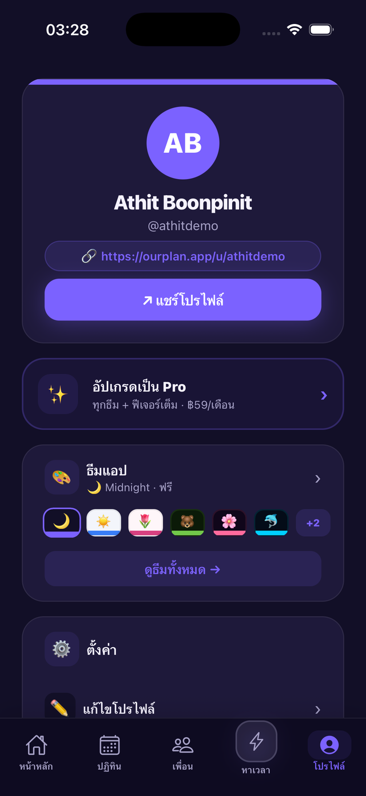
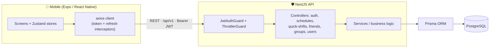

<p align="center">
  
</p>

# OurPlan

> **Plan together, not apart.** A full-stack social scheduling app that finds the time your group actually has free.

OurPlan is a cross-platform mobile app for managing your personal schedule and effortlessly finding overlapping free time with friends. Build your calendar, plan recurring work shifts in seconds with **Quick Shift**, then let **Find Time** scan everyone's availability to surface the slots when you're all genuinely free. It ships with a friends system, shared groups, eight hand-crafted themes, and full Thai/English localization — backed by a typed NestJS + Prisma + PostgreSQL API with JWT auth and refresh-token rotation.

<p align="center">
  
  
  
  
  
  
</p>

---

## Screenshots

| Home | Friends | Find Time | Profile |
| :--: | :-----: | :-------: | :-----: |
|  |  |  |  |

---

## Features

| Area | What it does |
| --- | --- |
| **Authentication** | Email + password sign-up and login, short-lived JWT access tokens with **refresh-token rotation**, and a full **forgot / reset password** flow with single-use, expiring tokens. |
| **Personal schedules** | Create, edit, and delete events with categories (Work, Health, Errand, Social, Travel, Other), locations, color tags, icons, recurrence rules, and per-event visibility (`private` / `friends` / `public`). |
| **Quick Shift** | A work-shift planner: tap to assign a shift (day / morning / night / off / leave …) to one date or **bulk-apply** across many. Shifts that block availability are factored into Find Time. |
| **Find Time** | Scans your calendar against selected friends to compute the **free slots everyone shares** over a configurable window (days, minimum duration, hours of the day). |
| **Friends** | Search users, send / accept / decline friend requests, view pending requests, and unfriend — with public profile pages and friend-status checks. |
| **Groups** | Create groups, rename or delete them, and add / remove members for shared planning. |
| **Themes** | **8 themes** — 3 free (Midnight, Daylight, Blossom) and 5 premium (Matcha Bear, Sakura Night, Ocean Buddy, Candy Pop, Neon Galaxy) — each a full color system applied app-wide. |
| **Localization** | First-class **Thai 🇹🇭 and English 🇬🇧** support throughout the UI. |
| **Pro tier** | A premium tier gating extras like unlimited friends, calendar export, advanced Find Time, premium themes, and sticker packs. *(Billing is stubbed — see [Notes / Roadmap](#notes--roadmap).)* |

---

## Tech Stack

**Mobile — `apps/mobile`** (~12k LOC)
- React Native `0.81` on **Expo SDK 54** (New Architecture enabled)
- **Expo Router** file-based navigation
- **Zustand** for state (auth, schedule, quick-shift, theme, language, pro)
- **axios** API client with token interceptors + transparent 401 refresh
- `react-native-maps` for the location picker, `expo-location`, `expo-image-picker`, `react-native-reanimated`, `expo-linear-gradient`

**API — `apps/api`**
- **NestJS 11** (modular controllers / services / DTOs)
- **Prisma 5** ORM over **PostgreSQL**
- **JWT** auth via `@nestjs/jwt` + Passport, `bcrypt` password hashing
- **@nestjs/throttler** rate limiting, `class-validator` request validation, global `/api/v1` prefix + CORS

**Workspace**
- **pnpm** workspaces monorepo (`apps/*`, `packages/*`), TypeScript end-to-end

---

## Architecture



**Auth / JWT flow.** On register or login the API issues a **short-lived access token** (default `15m`) and a **refresh token** (default `30d`), persisting the refresh token in the database. The mobile axios client attaches the access token to every request; on a `401` it transparently calls `POST /api/v1/auth/refresh`, which **rotates** the refresh token (the old one is deleted and a new pair is issued) before retrying the original request. Password resets invalidate all of a user's refresh tokens, forcing re-login everywhere.

---

## Monorepo Structure

```
ourplan/
├── apps/
│   ├── api/                  # NestJS 11 + Prisma + PostgreSQL
│   │   ├── prisma/
│   │   │   └── schema.prisma  # User, Schedule, QuickShift, Friendship, Group, tokens…
│   │   └── src/
│   │       ├── auth/         # JWT, refresh rotation, password reset
│   │       ├── schedules/    # CRUD + free-slot finder
│   │       ├── quick-shifts/ # work-shift planner
│   │       ├── friends/      # requests / accept / decline
│   │       ├── groups/       # group + membership management
│   │       ├── users/        # profiles, search, preferences
│   │       └── prisma/       # PrismaService
│   └── mobile/               # React Native + Expo SDK 54
│       ├── app/              # Expo Router routes (auth, tabs, event, groups…)
│       ├── store/            # Zustand stores
│       ├── lib/              # api client, date utils, exports
│       ├── components/       # UI + feature components
│       └── constants/        # theme.ts (8 themes), quickShift.ts
└── packages/
    └── shared/               # shared workspace package
```

---

## Getting Started

### Prerequisites
- **Node.js** ≥ 18
- **pnpm** ≥ 8 (`npm install -g pnpm`)
- **PostgreSQL** ≥ 14 running locally (or a connection string to one)
- For maps on a real device/simulator: the **Expo Go** app *or* a custom dev build, plus a **Google Maps API key**

### 1. Install
```bash
pnpm install
```

### 2. Configure environment
```bash
# API
cp apps/api/.env.example apps/api/.env
```
Then edit `apps/api/.env` and set at minimum:
- `DATABASE_URL` — your PostgreSQL connection string
- `JWT_SECRET` and `JWT_REFRESH_SECRET` — long random strings

For the mobile app, create `apps/mobile/.env`:
```bash
EXPO_PUBLIC_API_URL=http://localhost:3000/api/v1
```
> **Maps:** the location picker uses `react-native-maps`. Native builds read a **`GOOGLE_MAPS_API_KEY`** (configured under `expo.ios.config.googleMapsApiKey` in `apps/mobile/app.json`). Provide your own key there before producing a native build.

### 3. Set up the database
```bash
pnpm --filter api prisma migrate dev
```
This creates the schema and generates the Prisma client.

### 4. Run
```bash
# both apps together
pnpm dev

# …or individually
pnpm api      # NestJS on http://localhost:3000/api/v1
pnpm mobile   # Expo dev server
```

> **Docker:** no `docker-compose.yml` ships in this repo yet. The quickest path to a database is a one-off Postgres container, e.g.
> `docker run --name ourplan-db -e POSTGRES_PASSWORD=password -e POSTGRES_DB=ourplan -p 5432:5432 -d postgres:16`,
> then point `DATABASE_URL` at it. (A bundled compose file is on the roadmap.)

---

## API Overview

All routes are served under the global prefix **`/api/v1`**. Every group except the public auth endpoints requires a `Bearer` access token.

| Group | Base path | Representative endpoints |
| --- | --- | --- |
| **Auth** | `/auth` | `POST /register`, `POST /login`, `POST /refresh`, `GET /me`, `POST /forgot-password`, `POST /reset-password` |
| **Schedules** | `/schedules` | `GET /` (by date), `GET /month`, `GET /free-slots`, `GET /friends/all`, `GET /friend/:friendId`, `POST /`, `PATCH /:id`, `DELETE /:id` |
| **Quick Shifts** | `/quick-shifts` | `GET /?date=`, `GET /month`, `POST /`, `POST /bulk`, `DELETE /:date`, `DELETE /:date/:shiftKey` |
| **Friends** | `/friends` | `GET /`, `GET /pending`, `POST /request/:targetId`, `POST /:id/accept`, `POST /:id/decline`, `POST /:id/unfriend` |
| **Groups** | `/groups` | `GET /`, `POST /`, `PATCH /:id`, `DELETE /:id`, `POST /:id/members`, `DELETE /:id/members/:userId` |
| **Users** | `/users` | `GET /search`, `GET /me/preferences`, `PATCH /me`, `PATCH /me/preferences`, `GET /:slug`, `GET /:slug/schedules`, `GET /:slug/friend-status` |

> Sensitive auth endpoints are rate-limited via `@nestjs/throttler` (e.g. login `10/min`, register `5/min`, forgot-password `3/min`).

See [`apps/api/README.md`](./apps/api/README.md) for API-only setup details.

---

## Notes / Roadmap

**Honestly stubbed in this build**
- **Payments are a demo stub.** In-app purchases (premium themes, Pro subscription, sticker packs, tip jar) are wrapped around RevenueCat in `apps/mobile/lib/purchases.ts`, but the build ships with **placeholder API keys** behind a `IS_CONFIGURED` demo flag. Purchase calls short-circuit to "success" in development, so the full premium UX is browsable **without** being wired to a live billing provider in this repo.
- **Password-reset emails** are not sent; the reset token is logged/returned in development instead of being delivered by email.

**Future work**
- Push notifications (event reminders, friend requests, group invites)
- A bundled `docker-compose.yml` for one-command local Postgres + API
- Live deployment (hosted API + database, EAS-built mobile binaries)
- Real billing integration (replace the RevenueCat stub keys + entitlements)
- Test coverage expansion (e2e flows beyond the scaffolded specs)

---

## License

[MIT](./LICENSE)
